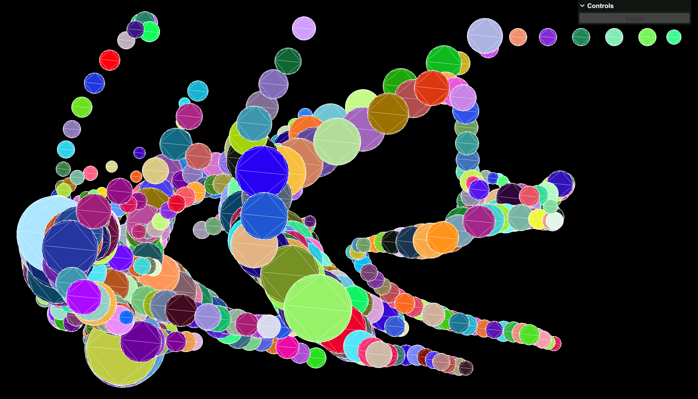
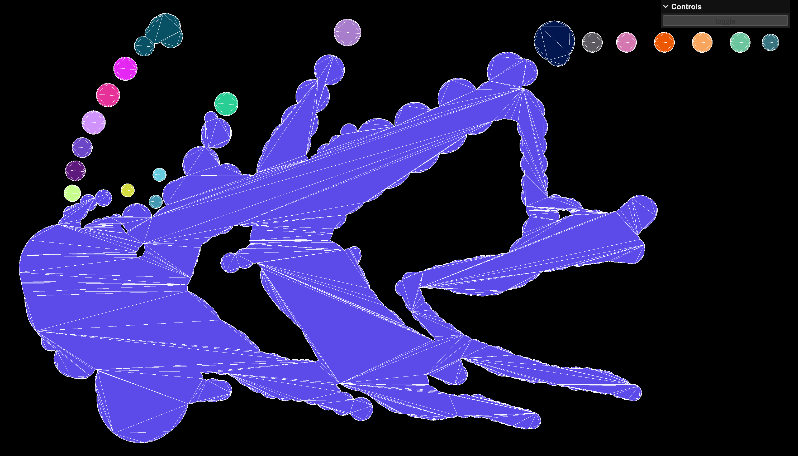

# 概述

该项目演示了如何使用 [@turf/union](https://www.npmjs.com/package/@turf/union) 来融合数量超多的几何图形，并且使用 [earcut](https://www.npmjs.com/package/earcut) 和 [three.js](https://www.npmjs.com/package/three) 来绘制融合后的集合图形。

 

# 原始

下图是融合之前的状态，图像中的圆形是根据真实的飓风数据所生成的，飓风的风速越快，圆形的半径越大。我们准备将所有的圆形都融合为一个几何图形。

 

# 结果

下图是融合之后的状态，所有的圆形都被融合成了一个几何图形，我使用线条来描绘出了它的三角剖分的结果。

右上角的 `Controls` 栏可以切换融合前与融合后的状态。

 

# 优化

该项目是通过遍历来融合所有圆形的，在实际应用中，可以考虑使用 R 树算法来替代遍历，这样可以显著提升程序的性能。

 

# 运行

依次执行下述命令，来运行该项目：

1. `npm install`
2. `npm run start`

由于程序的计算量较大，因此该程序在初次打开时，会经历一段白屏时间，这代表着程序正在运算中，稍等片刻就可以呈现出结果了。

 

# 许可

本项目遵循 [MIT](https://github.com/jynxio/storms/blob/main/license) 协议。

 
