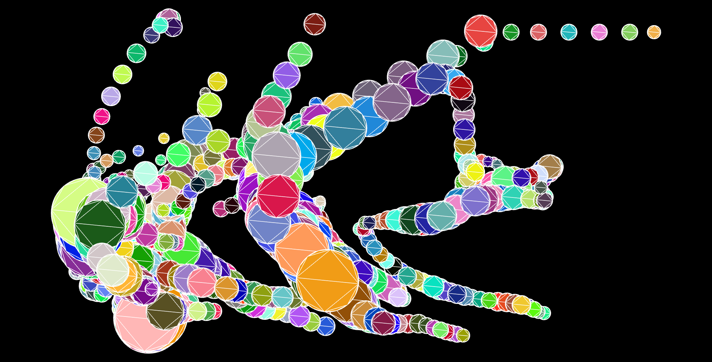
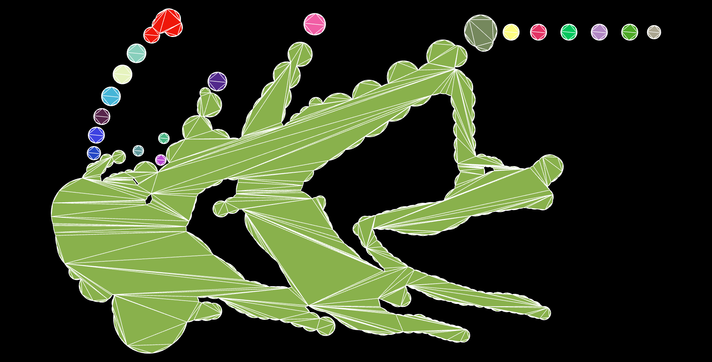

# toy-storm
> 重写该demo，更名为 simple-turfunion，使用R树加速处理

## 概述

该 demo 做了 2 件事情：

1. 将离散的飓风点数据渲染成离散的圆形几何；
2. 融合离散的圆形几何；

离散的圆形几何：  

   

融合离散的圆形几何：  

  

## 在线示例

https://storm-sooty.vercel.app/  

## 使用

- 下载。
- 执行 `npm run install`。
- 执行 `npm run start`。

> 注意：因数据下载与融合过程较慢，故首屏渲染时间较长，请耐心等待30s。
